# 🚀 Desafio Técnico – Microsserviços (Spring Boot + Spring Cloud)

## 📖 Descrição
Esse projeto foi desenvolvido para simular a criação/listagem de produtos como também a simulação de pedidos.
As tecnologias principais são:
- 🟢 **Spring Boot**  
- ☁️ **Spring Cloud**
- ☁️ **Spring Cloud Eureka**
- ☁️ **Spring Cloud Gateway**

O objetivo é aplicar conceitos modernos de arquitetura:  
✅ **Service Discovery**  
✅ **API Gateway**  
✅ **Comunicação entre microsserviços**  
✅ **Persistência de dados**  
✅ **Boas práticas REST**

---

## 🏗️ Arquitetura Proposta

```mermaid
flowchart TD
    Browser[💻 Browser] --> |Requisições HTTP| APIGW[API Gateway ☁️]
    APIGW --> |Service Lookup| Discovery[(Service Discovery 🔍)]
    APIGW --> MS1[Microservice 1 🛒 - Catálogo de Produtos]
    APIGW --> MS2[Microservice 2 📦 - Simulador de Pedidos]
    MS1 --> DB[(H2 Database 🗄️)]
```


- **Microservice 1 (Catálogo de Produtos 🛒)**  
  - Cadastrar produtos  
  - Listar produtos  
  - Consultar produtos (🔤 nome, 📝 descrição, 💲 preço)  
  - Persistência via **H2 Database**  

- **Microservice 2 (Simulador de Pedidos 📦)**  
  - Consulta produtos do Microservice 1  
  - Permite simulação de criação de pedidos (sem persistência)  

---

## 📌 Contexto do Negócio
👉 O sistema é um **mini-gestor de pedidos** com catálogo de produtos:  

### 🔹 Microserviço 1 – Catálogo de Produtos
- Permite:
  - ➕ Cadastrar produtos
  - 📜 Listar produtos
  - 🔎 Consultar produtos
- Persistência: **H2 Database**

### 🔹 Microserviço 2 – Simulador de Pedidos
- Faz chamadas ao **Microserviço 1**
- Cria pedidos **baseados em lista de produtos**
- ❌ Não possui persistência

---

## ⚙️ Requisitos Técnicos
O sistema deve:  
- 📦 Conter **dois microserviços independentes**  
- 🚀 Utilizar **Spring Boot** em todos os microsserviços  
- 🔍 Usar **Spring Cloud Eureka** como Service Discovery  
-  Utilizar **Spring Cloud Gateway** como API Gateway  
- 📡 Expor APIs REST com boas práticas  

### ✅ Garantias
- **Microserviço 1** deve ser acessível por `/products`  
- **Microserviço 2** deve ser acessível por `/order/simulate`  
- Todos os endpoints devem ser acessados **via API Gateway**

---

## 🌐 Portas
| Serviço | Faixa de Portas |
|---------|----------------|
| 🛒 Microservice 1 – Produtos | `8100` |
| 📦 Microservice 2 – Pedidos | `8200` |
| ☁️ API Gateway | `8700` |
| ☁️ Eureka Server | `8761` |

---

## ▶️ Como preparar o ambiente local
### 🔧 Pré-requisitos
- ☕ Java 21+  
- 🛠️ Maven     

### 🚀 Passos
1. **Clonar o repositório**  
   ```bash
   git clone https://github.com/seu-repo/desafio-microservicos.git
   cd desafio-microservicos
   ```
2. **Subir o Service Discovery (Eureka)**  
   ```bash
   cd nttdioservicediscovery
   mvn spring-boot:run
   ```
3. **Subir o API Gateway**  
   ```bash
   cd nttdioapigateway
   mvn spring-boot:run
   ```
4. **Subir os Microserviços**  
   ```bash
   cd nttdioproductcatalog
   mvn spring-boot:run

   cd nttdioordersimulator
   mvn spring-boot:run
   ```
5. Executar exemplos de posts pelas URLs 🌍  
   ```
   POST http://localhost:8700/product-catalog-service/products/create
   GET http://localhost:8700/product-catalog-service/products/all
   GET http://localhost:8700/product-catalog-service/products/all
   POST http://localhost:8700/order-simulator/order/simulate 
   ```

---

## 📡 Exemplos de Endpoints

### 🛒 Microserviço 1 – Produtos
- `POST /product-catalog-service/products/create` → Cadastrar produto  
  ```json
  {
    "name": "Notebook",
    "description": "Dell Inspiron",
    "price": 3500.00
  }
  ```

- `GET /products/all` → Listar todos produtos  
- `GET /products/{id}` → Consultar produto por ID  

---

### 📦 Microserviço 2 – Pedidos
- `POST /order-simulator/order/simulate` → Simula pedidos com base em uma lista de produtos e suas quantidades  
  ```json
  {
    "items": [
      {"productId": 1, "quantity": 2},
      {"productId": 2, "quantity": 10},
    ]
  }
  ```

---


## 👨‍💻 Autor
Dimitri Vinicius da Silva Ferraz
Desenvolvido como desafio técnico proposto pela **NTT Data**.  
